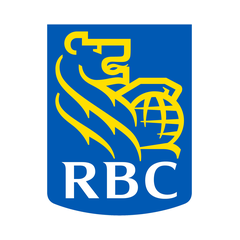

# William O'Connell

**Quantitative Trading Analyst & AI Engineer** — Rates · Credit · Equities 
Mathematics, Honours, Co-op @ University of Waterloo

[williamo-c.github.io](https://williamo-c.github.io) · [LinkedIn](https://www.linkedin.com/in/william-oconnel/) · [woconnel@uwaterloo.ca](mailto:woconnel@uwaterloo.ca)

Five work terms on trading desks — RBC, BMO, and CIBC Capital Markets — building the analytics, automation, and models that traders and salespeople actually use day to day. Heading back to RBC this fall. Outside of that: Project Euler (top 1%) and Jane Street's monthly puzzle, mostly for the same reason.

## Experience

<table>
<tr><td width="44"></td><td><b>RBC Capital Markets</b> — Quantitative Trading Analyst & AI Engineer, Global Edge Program New York, NY · Sep – Dec 2026 (incoming)</td></tr>
<tr><td></td><td><b>RBC Capital Markets</b> — Quantitative Trading Analyst & AI Engineer, Municipal Systematic / Lev Fin / EQD Flow / IG Credit / Rates / Money Markets Jan – Apr 2026</td></tr>
<tr><td></td><td><b>BMO Capital Markets</b> — Global Markets Quantitative Analyst, Rates Sales, Strategy & Trading Sep – Dec 2025</td></tr>
<tr><td></td><td><b>CIBC Capital Markets</b> — GM & IB Analyst, Securitization & Financial Institutions Group Jan – Apr 2025</td></tr>
<tr><td></td><td><b>CIBC Capital Markets</b> — Global Markets Analyst, eFICC Trading May – Aug 2024</td></tr>
</table>

A few of what got built on desk (internal, so no code to link): a sales recommendation engine for credit trade axes, a commission reconciliation platform that recovered $1.5M/year in previously written-off commissions, and a bond cost basis interpolator (RBC); a bond duration & roll-date framework and markout models for adverse-flow detection (BMO); a real-time conduit tracking tool across a $10B+ deal portfolio (CIBC). Full write-ups on the [site](https://williamo-c.github.io).

## Building

- **[swaption-pricer](https://github.com/WilliamO-C/swaption-pricer)** — a from-scratch USD swaption pricing library: a real bootstrapped Treasury curve, Black-76, the Bachelier normal model, and full SABR smile calibration, with closed-form Greeks and a 36-test suite.
- **[stock_predictor](https://github.com/WilliamO-C/stock_predictor)** — a hybrid technical + LLM news-sentiment predictor for small/mid-cap equities, built from a 2026 *Journal of Financial Economics* paper, with a dual-provider data layer and a growing SQLite reservoir fed by a daily job.
- Jane Street's [monthly puzzle](https://www.janestreet.com/puzzles/), solved for fun.

## Tools

Python, SQL, R, VBA, DAX · NumPy, Pandas, SciPy, Matplotlib · Power BI, Tableau, Bloomberg Terminal, Git, Jupyter · S&P Capital IQ, Fitch, Moody's, DBRS

Waterloo, ON · New York, NY
